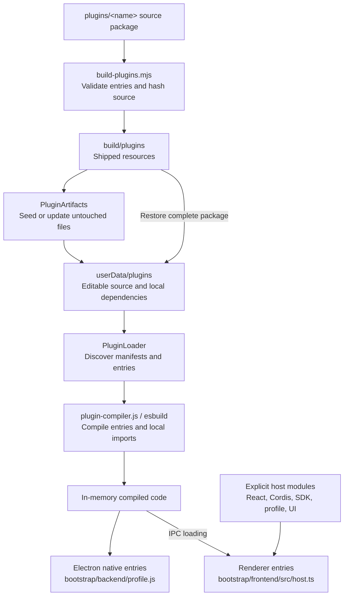
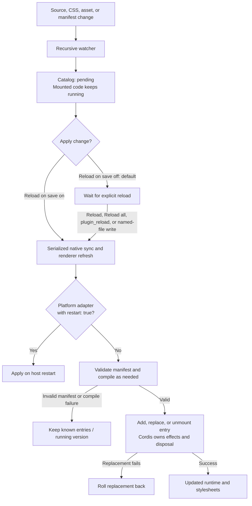
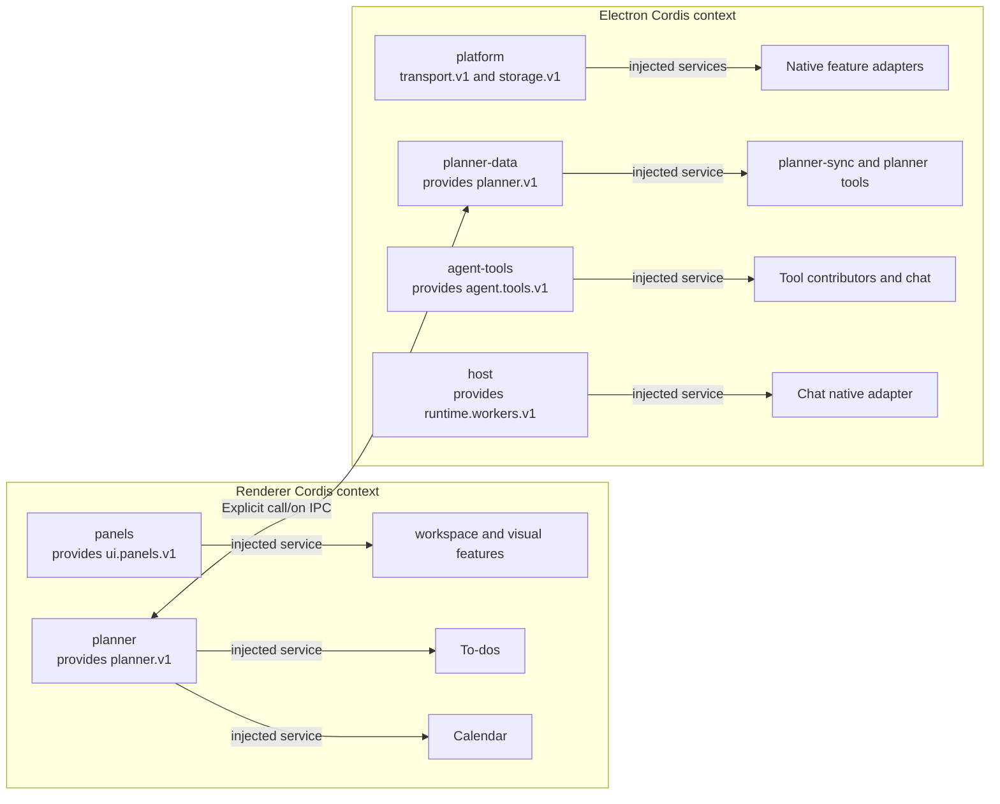
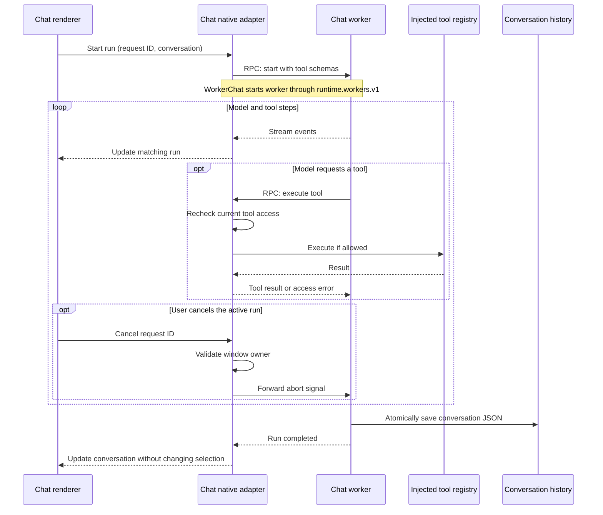
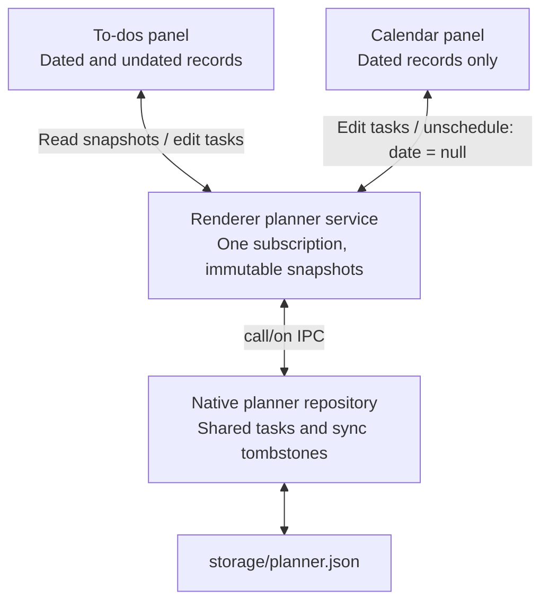

# Architecture

Cordis owns activation, injection, scoped service resolution, effects, and disposal.
`shared/runtime` adds IDs, a lifecycle queue, remembered toggles, and rollback for
failed replacement; it does not implement a dependency engine.

## Project map

The app is a desktop runtime that can be recomposed while it is running. There is
one Cordis root in the backend and one in each frontend window; IPC connects the
processes. Adding a feature does not require changing a host import list.

```text
bootstrap/
  backend/             Electron startup, preload, compiler, and protected loader
  frontend/            Window startup, host module table, and plugin loading
plugins/
  <feature>/
    package.json       Optional frontend and backend entry points
    frontend/          UI, styles, and frontend services
    backend/           Desktop services, resources, and workers
  python/service/      Python server source and its development environment
shared/
  runtime/             Cordis lifecycle wrapper and remembered toggles
  sdk/                 Service contracts and types
  ui/                  Reusable components
  backend/             Reusable filesystem and shell helpers
scripts/               Build, sync, test, and packaging commands
```

Only create the parts a feature needs. To-dos and Calendar are frontend-only;
Files and Shell are backend-only. Shared libraries are ordinary imports, not
independently mounted features. Their existing npm names (`@sisyphus/profile`,
`@sisyphus/native`, `@sisyphus/sdk`, and `@sisyphus/ui`) remain stable so editable
plugins can keep their imports. This checkout has no mobile target.

Dynamic composition is an architectural requirement: dependencies use Cordis
injection, resources belong to disposable effects, and saved data outlives a
plugin instance. Frontend edits do not invalidate backend jobs; backend edits do
not invalidate frontend code. Files shared at the feature root invalidate both.
Explicit reloads carry their requested IDs across IPC, so the frontend can apply
them immediately while ordinary watcher notifications remain pending. Frontend
code reads wait for backend compilation to finish.
The protected loader/bridge still bootstraps this mechanism, and Electron platform
adapters retain their explicit restart requirement. This restructure does not
claim to support live replacement of the transport carrying a reload.

## Source packages

`plugins/<name>/package.json` declares frontend and/or backend entry points:

```json
{
  "name": "@sisyphus/plugin-example",
  "type": "module",
  "sisyphus": {
    "frontend": {
      "id": "feature.example",
      "entry": "./frontend/index.tsx",
      "export": "examplePlugin"
    },
    "backend": [{ "id": "desktop.example", "entry": "./backend/index.js" }]
  }
}
```

A frontend entry exports a Cordis plugin object. Backend entries export an object
or a factory receiving host paths (`userData`, `hostDir`, `frontend`, `preload`).
CommonJS backend source has its own `backend/package.json` with `type: commonjs`.
Backend implementation, prompts, worker code, and frontend assets stay in the same
feature package. Shared libraries are `shared/sdk`, `ui`, `runtime`, and `backend`;
features communicate through injected services rather than importing each other.

Frontend entries map to the existing `renderer` IPC target; backend entries map
to `main`. Those wire names and plugin IDs remain stable. Legacy `entry`/`native`
manifests also remain loadable. During the source-layout migration, an edited
legacy package is retained as a whole, including its old import paths. Restore
or an explicit forced sync adopts the new shipped layout; untouched packages
upgrade automatically.

`scripts/build-plugins.mjs` validates entry points and stages original source under
`build/plugins`, with hashes in a distribution manifest. Packaging ships this tree
as resources. `PluginArtifacts` seeds it into `userData/plugins`: untouched files
advance to a new shipped version, local edits survive, and Restore copies shipped
source back. Restoring an entry restores its complete package, including shared
native and renderer files. Removed entry points stay removed in the package's
locally edited manifest. Legacy flat `.renderer.js` / `.main.js` / `.main.cjs`
plugins remain supported, including Plugin studio's small script templates.

`PluginLoader` discovers package manifests at runtime. `plugin-compiler.js` uses
esbuild asynchronously to compile the app-data entry point and its local imports.
Generated code is cached in memory, never treated as editable source. React,
Cordis, SDK, profile, and UI imports in renderer plugins resolve to explicit host
modules, ensuring one React instance. Other dependencies are bundled from the
installed dependency tree. Plugins can carry their own dependencies in their
folder. A distribution must include the dependencies its source packages need.
The packaged host uses ordinary files (`asar: false`) because the native compiler
and spawned executables need real filesystem paths.

The host has no feature imports. `bootstrap/backend/profile.js` discovers source
packages, loads native entry points, and installs the loader and worker factory.
The frontend boot only provides the desktop/storage bridge, runtime module table,
and plugin library. `bootstrap/frontend/src/host.ts` loads renderer entries over IPC.
Even Workspace, Theme, and the panel registry are runtime-loaded plugins.

### Source-to-runtime path

The editable source lives in app data; compiled output is an in-memory cache.
Renderer host modules are shared so runtime-loaded features use one React instance.



## Reload lifecycle

Noticing a change and applying it are separate. The recursive watcher detects
changes to source, CSS, assets, and manifests and reports the affected entries as
`pending` in the catalog; the code that is already mounted keeps running.
Mounting happens on an explicit reload: Plugin studio's **Reload** or **Reload
all**, the agent's `plugin_reload`, or a write that names the file. Reload on save
is the opt-in that hands the decision to the watcher, and it is off by default. A
reload mounts the file that is on disk now, in place: a mounted id is replaced, a
file that appeared is added, a file that is gone is unmounted, and a manual reload
also invalidates the compiled entry and local imports. Native sync and renderer
refresh are serialized; Cordis disposes old effects and mounts new code. Compile
errors preserve the running version and roll the replacement back. Invalid
manifests preserve previously known entries until repaired. New/removed entry
points mount/unmount without host edits. Each renderer stylesheet follows its
plugin and is replaced on reload.



A reload happens under the blocks that are on screen, and it does not disturb them.
A plugin's panel is withdrawn when its old code is disposed and registered again when
its new code mounts, so the panel registry holds a withdrawal for a turn and lets a
registration of the same id inside that turn replace it. A contribution that comes
back in the same turn never left: the block keeps drawing, its icon stays in the rail,
and nothing is told that the plugin went away. Blocks close when a contribution is
really gone - a plugin unmounted, deleted, or switched off - which is the rule the
plugins drawer describes. A block's error boundary is cleared when new code arrives
for it, so a failed version does not sit on top of the one that replaced it.

The Electron platform adapters declare `restart: true`: replacing transport,
window ownership, or storage while handling a reload would invalidate the reload
itself. Their source is editable but changes take effect on restart. Feature
adapters do not have this restriction. Reloading a native feature disposes its
resources: terminals close, Python servers stop, and chat workers cancel active
runs. UI navigation alone never cancels chat.

The host's protected loader and worker factory are bootstrap infrastructure.
Cordis is a composition system, not a hostile-code sandbox. UI plugins share the
renderer and trusted native adapters share Electron; CPU-heavy model processing
and transcript I/O run in a chat worker. Shell commands and filesystem MCP
operations already execute in child processes. Shell/WSL discovery and Windows
process-tree cancellation use asynchronous OS calls.

## Contracts and composition

| Contract                     | Provider     | Consumers                                  |
| ---------------------------- | ------------ | ------------------------------------------ |
| `ui.panels.v1`               | panels       | workspace, every visual feature            |
| `planner.v1` (renderer)      | planner      | todo, calendar                             |
| `planner.v1` (native)        | planner-data | planner-sync, planner tool adapter         |
| `agent.tools.v1`             | agent-tools  | files, shell, planner, plugin loader, chat |
| `runtime.workers.v1`         | host         | chat native adapter                        |
| `transport.v1`, `storage.v1` | platform     | native feature adapters                    |

Consumers declare `inject`; providers declare `provide`; registrations use
`ctx.effect` with disposers. Todo and Calendar resolve the same planner service
from their Cordis context. Neither imports the other or a concrete repository.
Cordis can scope a replacement service with `ctx.isolate`; the default workspace
uses one shared planner scope. Electron and renderer contexts are separate, joined
by explicit `call/on` IPC contracts rather than shared objects.



Arrows within each context show service provision to consumers. The matching
`planner.v1` names belong to separate contexts; objects do not cross IPC.

## Chat

`plugins/chat/backend/chat.js` owns Electron integration, encrypted keys, and tool
access checks. Its `WorkerChat` client starts `native/worker.js` through the worker
service. The worker owns model streams, the message tree, and per-conversation
history files. Tool definitions travel as JSON schemas; execution returns through
RPC to the injected tool registry. Abort signals cross this boundary explicitly.
Changing tool access is checked again when a tool executes. Worker errors reject
pending calls; disposal aborts work and terminates the worker after a bounded wait.



The worker owns model streams and history I/O; the native adapter owns host
integration and permission checks. Cancellation can occur while a run is active.

Runs are keyed by request ID, with at most one run per conversation, not one per
window. The renderer tracks all runs separately and only shows the selected one's
stream. Background completion updates that conversation without changing the open
view. Token events publish UI updates at most about 30 times per second; completed
Markdown is memoized. Cancellation checks the request's window owner.

`ChatService` stores the SDK's accumulated `responseMessages`, including every
assistant/tool step and provider options. Completed steps are also retained if a
later step fails. Branch selection replays only the chosen path. Compatible APIs
receive `reasoning_content`; provider-specific reasoning metadata is preserved for
Responses APIs. The stable system prefix no longer inserts a changing timestamp.
Caching still depends on the provider and on an unchanged prompt/tool definition
prefix; it is not guaranteed by the app.

The context indicator reports the latest step's input plus output tokens, never
summed input usage across tool steps. Providers without usage get a labeled
serialized-length estimate. This is a context size indicator, not a model-limit
percentage or compaction mechanism. Historical records missing original model
messages cannot recover tool results that were never saved.

History is one JSON document per conversation under `storage/chat.threads`, with
atomic replacement and a one-time legacy import. Folder permissions remain bound
to each conversation; file tools and commands validate their scope.

## Planner

The native repository keeps the existing `storage/planner.json` document and sync
tombstones. Tasks have optional dates; `date: null` clears a date. Existing `todo`
and `event` kinds remain readable, and both views operate on the same records.
New items created from either view are tasks. Calendar selects dated records;
To-dos includes dated and undated records. Either view can change completion and
dates. Calendar's unschedule action clears the date without deleting the task.

The renderer planner plugin owns one subscription and immutable snapshots. Todo
and Calendar are separate packages and panels, so removing either UI leaves the
other and its data intact. The workspace migrates saved Planner panels to To-dos.
File sync remains available in To-dos.



Both panels operate on the same records. Unscheduling keeps the task; removing a
panel leaves the other view and stored data intact.

## Developer loop

`npm run plugins:watch` rebuilds the staging manifest and copies source changes to
app data. The app's source watcher then compiles them and reports the changed
entries as pending; with Reload on save off, which is the default, each copy waits
for **Reload** or **Reload all** in Plugin studio before it is mounted.
`npm run dev:app` combines this watcher with Vite and Electron. `plugins:sync`
performs a one-time stage/copy, preserving app-data edits unless `--force` is given.
Use `--dest` or `SISYPHUS_USER_DATA` to select an isolated installation. Shared host
contracts and libraries still require a host rebuild/restart.
