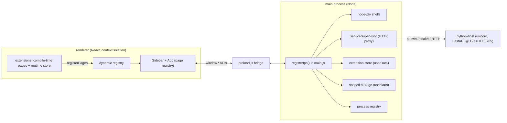

# Architecture

> The full design document lives at [`../ARCHITECTURE.md`](../ARCHITECTURE.md).
> This page is the condensed, navigable version.

## Big picture

## Repository layout

| Path | What it is |
| --- | --- |
| `apps/desktop` | Electron main process (`main.js`) + preload bridge (`preload.js`), plus testable logic in `lib/` (`backends.js`, `service-supervisor.js`, `processes.js`, `extension-store.js`, `app-storage.js`) |
| `apps/frontend` | React + Vite + TypeScript UI (the renderer) |
| `apps/mobile` | Placeholder (empty) |
| `packages/` | First-party workspace packages, one `@sisyphus/extension-*` per shipped extension |
| `packages/shared` | Framework-agnostic contracts: IPC channel names, `ExtensionManifest`/`ExtensionPage`, managed-process types. Compiled to CJS `dist/` by its `prepare` script so both the ESM frontend and CJS main process import it by name |
| `packages/runtime-extensions/` | Bundled runtime extensions (plain manifest + ESM entry), seeded into the userData store on first run |
| `services/python-host` | FastAPI service spawned and managed by the main process; venv at `services/python-host/.venv` |
| `scripts/` | Reproducibility entry points: `setup.py`, `test.py`, `build.py`, `package.py`, `build_and_run_desktop.py` |

## Monorepo wiring

The root is an npm workspaces monorepo (`"workspaces": ["apps/*", "packages/*",
"services/*"]`). Dependencies install once at the root; `package-lock.json` at
the root is canonical and there are no per-app lockfiles. Workspace packages
are symlinked into consumers' `node_modules`, so apps import them by package
name (e.g. `@sisyphus/shared`).

## Process model

- The renderer runs with `contextIsolation: true` and `nodeIntegration: false`.
  The only bridge is `preload.js` — see [IPC Reference](IPC-Reference.md).
- All IPC channels register in one place, `registerIpc()` in `main.js`.
- `main.js` sets no application menu; `F12` toggles DevTools in
  `createWindow()`.

## Frontend conventions

- **Pages are extensions.** `apps/frontend/src/extensions/index.tsx` is the
  compile-time page registry; the `Sidebar` renders nav items from it and
  `App` mounts pages from it. See [Extensions](Extensions.md).
- **Styling:** CSS modules (`*.module.css`) with kebab-case class names; JS
  reads them camelCase via `localsConvention: 'camelCaseOnly'` in
  `vite.config.ts`. Design tokens and shared primitives stay global in
  `src/index.css`.
- **Icons:** extensions own their icons — each ships an `icon.svg` next to its
  source, imported `?raw` and passed as inline SVG markup in the page
  descriptor. The shared `Icon` component renders that markup. See
  [Extensions](Extensions.md#icons).

## Two-zone model

- **Install zone (read-only):** the app bundle — `main.js`, `preload.js`, the
  frontend `dist/`, the `node-pty` native binary. Never written at runtime.
- **User zone (writable):** `app.getPath('userData')` — settings, app state,
  the extension store, and scoped storage. Never shipped in the installer.

`userData` resolves to `%APPDATA%\Sisyphus` (Windows), `~/Library/Application
Support/Sisyphus` (macOS), or `~/.config/sisyphus` (Linux). See
[Packaging](Packaging.md) for how the bundle is produced.
