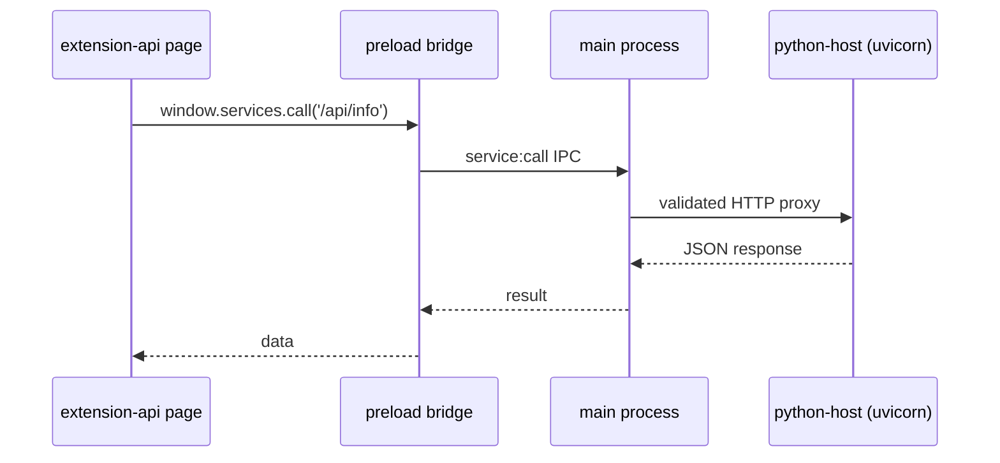

# Managed Services

`services/python-host` is a FastAPI app spawned by the Electron main process
on startup and killed on quit. It demonstrates how the app owns and exposes
additional processes beyond its own renderer.

## How it runs

- The main process owns a `ServiceSupervisor`
  (`apps/desktop/lib/service-supervisor.js`): it resolves the venv python,
  spawns uvicorn on `127.0.0.1:8765`, polls `/health`, and reports a
  `ServiceStatus`.
- The supervisor is a plain Node module with **injectable spawn+fetch**, which
  is what makes it unit-testable (see [Testing](Testing.md)).
- A `SISYPHUS_PYTHON` env override selects a different interpreter than the
  bundled venv.
- Dependencies are pinned in `services/python-host/requirements.txt`; the venv
  lives in `services/python-host/.venv` (created by `scripts/setup.py`).
- `addons/` and `backends/` are reserved for future host-side plugins.

## Endpoints

| Route | Purpose |
| --- | --- |
| `GET /health` | Liveness endpoint the supervisor polls |
| `GET /api/info` | Sample data endpoint: service name, Python version, platform, UTC time, interpreter path |

## Renderer flow

The frontend never talks to the service directly:



`service:call` validates paths (they must start with `/`) and is scoped to the
python-host API — see [IPC Reference](IPC-Reference.md).

## Adding an endpoint

1. Add a route to `services/python-host/app/main.py`, e.g.:

   ```python
   @app.get("/api/hello")
   def hello() -> dict:
       return {"message": "hello"}
   ```

2. Add a matching test in `services/python-host/tests/`.
3. Call it from the renderer with `window.services.call('/api/hello')` — the
   proxy needs no changes for new GET routes.

## Health & status

`service:status` returns the supervisor's `ServiceStatus` (service running or
not, last health result). The `extension-api` page surfaces this status and
drives the sample endpoint through IPC.
